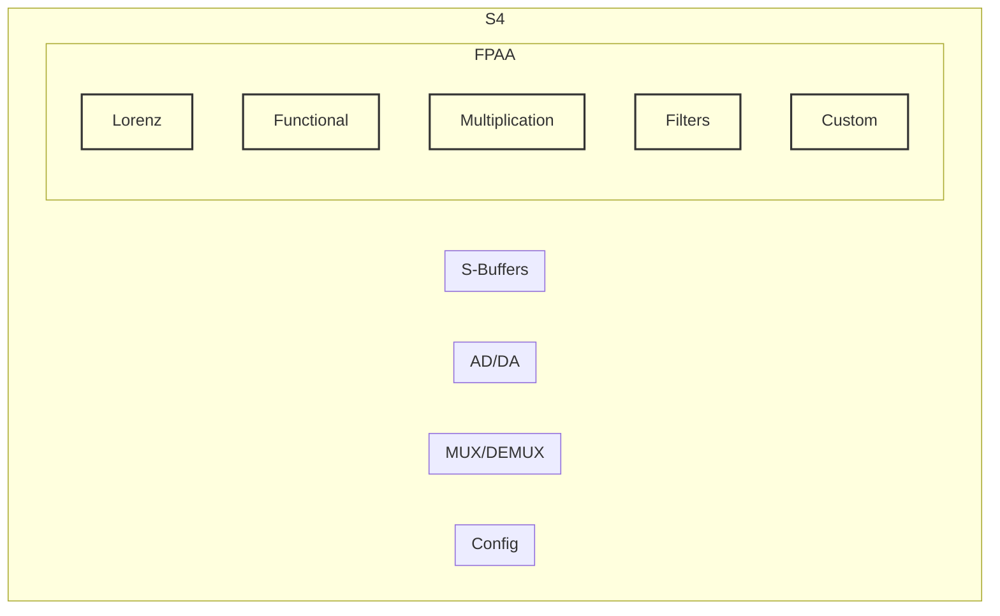

About:

This is an AGI accelerator ASIC/FPAA targeting two process node:

- 600nm NMOS FlexIC process (low cost prototyping and application under $20k per tapeout)
- 130nm BiCMOS Open Source PDK targeting 500Ghz signals

It is similar to FPAA/PAnIC (mainly used in Software Defined Radio) but highly focused on AGI application and multiple types of analog computation: Lorenz differntiation, Functional differntiation, massive efficient multiplication and some cutomizable analog computational models.

EDA tools:

- Berkeley Analog Generator (BAG) 2.0
- nMigen
- OpenLANE
- Magic 